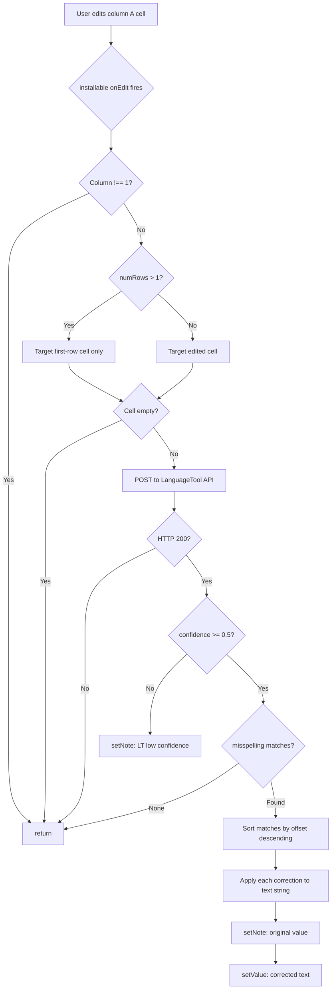

# feat: Add Google Apps Script spell-check for vocabulary sheet column A

## Summary

Add a Google Apps Script bound to the vocabulary Google Sheet that auto-corrects spelling errors and missing accents in column A the moment a cell is edited. The script calls the LanguageTool free REST API via an installable `onEdit` trigger, applies spelling-only corrections in-place, and records the original value as a cell note so corrections are auditable.

---

## Problem Frame

Words entered in column A flow verbatim to Anki card fronts — `tools/sheets_to_anki.py` applies only `.strip()` before passing each cell to the CLI. Prior run logs show 20+ committed cards with stripped accents (`caída` → `caida`, `últimamente` → `ultimamente`) and transposition errors (`convención` → `covencion`). Once a row is marked done in column D it is never re-processed, so fixing a typo after sync requires manual Anki intervention. No correction path exists today.

---

## Requirements

Carried from origin document (`docs/brainstorms/2026-06-18-vocab-sheet-spell-check-requirements.md`):

**Entry trigger**

- R1. The script registers an installable `onEdit` trigger on the vocabulary sheet, column A only.
- R2. The trigger fires on every cell edit in column A, including single-character changes.
- R3. Empty cells are skipped without an API call.

**Correction behavior**

- R4. On trigger, the script sends the edited cell's value to the LanguageTool free REST API with `language=auto` and `preferredVariants=es-ES,en-US`.
- R5. If the API returns spelling correction matches, the script replaces the cell value with the fully-corrected text.
- R6. If the API returns no spelling corrections, the cell is left unchanged.
- R7. Grammar and style suggestions are ignored — only matches where `rule.issueType === "misspelling"` are applied.
- R8. Multi-word phrases are corrected as a whole; multiple matches are applied in reverse offset order to keep positions valid throughout the pass.

**Scope constraints**

- R9. The script writes only to the column A cell that triggered the edit; columns B, C, and D are not modified.
- R10. The script does not reprocess existing rows; correction applies only at the moment of entry.

**Planning decisions (resolved from origin's deferred-to-planning questions)**

- R11. When a correction fires, a cell note is added recording the original (pre-correction) value.
- R12. For bulk paste events (more than one row edited at once), only the first row of the paste is corrected; subsequent rows are left unchanged to stay within the 20 req/min free-tier rate limit.
- R13. When LanguageTool's language detection confidence is below 0.5, correction is skipped and the cell note is set to `"LT: low confidence"` so the user knows detection was ambiguous.

---

## Key Technical Decisions

- **Installable trigger, not simple trigger.** The reserved `onEdit(e)` function runs without authorization and cannot call `UrlFetchApp`. The script uses a renamed function (`handleEdit`) registered via `ScriptApp.newTrigger()`. A `createTrigger()` helper runs once at setup time.

- **`language=auto` with `preferredVariants=es-ES,en-US` plus confidence guard.** The sheet is bilingual (Spanish entries and English entries both appear in column A). Fixing the language to `es` would mishandle English words. Auto-detect with preferred variants guides the detector toward the two expected languages. The `confidence` field in `result.language.detectedLanguage` (0–1 float) guards against misidentification on short single-word inputs — a documented LanguageTool limitation for inputs under ~5 tokens.

- **`rule.issueType === "misspelling"` filter.** LanguageTool frequently returns grammar, style, and typography matches. This single filter satisfies R7 without needing a maintained category blocklist.

- **Reverse-offset match application.** When multiple spelling matches appear in a phrase, applying them in ascending offset order shifts positions and corrupts later corrections. Sorting by `offset` descending before applying keeps all positions valid.

- **`disabledCategories=PUNCTUATION,TYPOGRAPHY`.** Prevents LanguageTool from returning smart-quote and punctuation suggestions that would corrupt vocabulary entries (e.g., adding curly quotes around a word).

- **First-row-only bulk paste.** Correcting every pasted row risks the 20 req/min rate limit. Processing only the first row is deterministic, avoids limit pressure, and matches the user's stated preference. The remaining pasted rows are left as-is.

---

## High-Level Technical Design



---

## Output Structure

```
tools/
  vocab_spell_check.gs       new — Apps Script main function + trigger installer
  appsscript.json            new — OAuth scope manifest for the Script Editor
workflows/
  vocab_spell_check.md       new — SOP: install, authorize, and test the script
```

---

## Implementation Units

### U1. Apps Script spell-check implementation

**Goal:** Implement the `handleEdit` trigger function and `createTrigger` one-time installer, covering R1–R13 and all acceptance examples.

**Requirements:** R1–R13, F1–F4

**Dependencies:** None

**Files:**
- `tools/vocab_spell_check.gs` (new) — main script
- `tools/appsscript.json` (new) — project manifest

**Approach:**

`appsscript.json` must declare two OAuth scopes:
- `https://www.googleapis.com/auth/spreadsheets`
- `https://www.googleapis.com/auth/script.external_request`

Without the `external_request` scope, `UrlFetchApp.fetch()` silently fails with a permissions error under the installable trigger authorization model.

`vocab_spell_check.gs` exposes two top-level functions:

**`createTrigger()`** — Run once from the Script Editor to register the installable trigger. It calls `ScriptApp.newTrigger('handleEdit').forSpreadsheet(ss).onEdit().create()`. Document in comments that running it more than once creates a duplicate trigger; the implementer should decide whether to add a guard (see Open Questions).

**`handleEdit(e)`** — The trigger handler. Directional logic:

1. If `e.range.getColumn() !== 1`, return immediately.
2. Determine the working cell:
   - Single-cell edit (`e.range.getNumRows() === 1`): use `e.range` as-is.
   - Bulk paste (`numRows > 1`): get `e.range.getSheet().getRange(e.range.getRow(), 1)` for the first row only.
3. Read the cell value; if empty string, return.
4. POST to `https://api.languagetool.org/v2/check` via `UrlFetchApp.fetch()` with form-encoded payload: `text`, `language=auto`, `preferredVariants=es-ES,en-US`, `disabledCategories=PUNCTUATION,TYPOGRAPHY`. Set `muteHttpExceptions: true` so network errors return a response object rather than throwing.
5. If response code ≠ 200, return without modifying the cell.
6. Parse response JSON. Check `result.language.detectedLanguage.confidence`; if below 0.5, call `cell.setNote("LT: low confidence")` and return.
7. Filter `result.matches` to entries where `match.rule.issueType === "misspelling"` and `match.replacements.length > 0`. If none remain, return.
8. Sort filtered matches descending by `match.offset`. For each match in order, reconstruct: `text = text.slice(0, match.offset) + match.replacements[0].value + text.slice(match.offset + match.length)`.
9. Call `cell.setNote(originalValue)` then `cell.setValue(correctedText)`.

**Patterns to follow:** `tools/setup.py` `run_cmd()` — captures errors, warns, never propagates exceptions to the user. Same principle here: all code paths end in either a correction or a silent return, never an uncaught exception visible to the user.

**Technical design note** (directional, not prescriptive): the correction reconstruction in step 8 iterates over a sorted matches array mutating a local `text` string. Because offsets refer to positions in the *original* text (before any correction is applied), working from the end of the string toward the beginning ensures each substitution does not shift positions for earlier matches still to be processed.

**Test scenarios:**

- Covers AE1. Enter `caida` in column A → cell updates to `caída`; cell note reads `caida`.
- Covers AE2. Enter `covencion` → cell updates to `convención`.
- Covers AE3. Enter `ultimamente` → cell updates to `últimamente`.
- Covers AE4. Enter `distrubute` → cell updates to `distribute`.
- Covers AE5. Enter `skydiving` → cell unchanged; no note added.
- Covers AE6. Enter `Has oido de la ministra` → cell updates to `Has oído de la ministra`.
- Covers AE7. Edit an empty cell in column A → no API call; cell unchanged.
- Edit a cell in column B → function returns immediately; column B unchanged.
- Paste 3 rows into column A (first row contains `caida`) → first row corrects to `caída`; rows 2 and 3 unchanged.
- Simulate `detectedLanguage.confidence = 0.3` → cell unchanged; note reads `"LT: low confidence"`.
- Simulate LanguageTool HTTP 500 → cell unchanged; no note set.
- Enter a phrase with two misspellings (e.g., `ultimamente me siento caida`) → both corrected in one pass using reverse-offset application.

**Verification:** Open the vocabulary sheet, type `caida` in column A, press Enter. Within 1–2 seconds the cell should update to `caída` and show a note indicator in the corner.

---

### U2. Installation workflow documentation

**Goal:** Document the complete installation and verification procedure so the script can be set up without external guidance, and surface the script in the existing workflow.

**Requirements:** Covers overall usability of R1 (trigger registration must be discoverable by the user).

**Dependencies:** U1

**Files:**
- `workflows/vocab_spell_check.md` (new)
- `workflows/sheets_to_anki.md` (modify — add one-line reference in the One-Time Setup section)

**Approach:**

`workflows/vocab_spell_check.md` covers:

1. Open the Google Sheet → Extensions → Apps Script.
2. Enable manifest editing: Project Settings → check "Show `appsscript.json` manifest file in editor."
3. Paste the contents of `tools/appsscript.json` into the manifest editor, replacing the default content. Save.
4. In the `.gs` file (or rename `Code.gs`), paste the contents of `tools/vocab_spell_check.gs`. Save.
5. Run `createTrigger()` once: select it from the function dropdown, click Run. Accept the authorization dialog — this is where the `external_request` scope is granted.
6. Return to the sheet. Type a misspelled word (e.g., `caida`) in column A and press Enter. The cell should update to `caída` within a second or two.

Troubleshooting section should cover:
- Trigger not firing → check Extensions → Apps Script → Triggers; confirm `handleEdit` appears with event type "From spreadsheet / On edit."
- `UrlFetchApp` permission error → trigger was registered as a simple trigger (function named `onEdit`), not installable. Delete the trigger, rename the function to `handleEdit`, re-run `createTrigger()`.
- Correction not applying but no error → check cell note; if it reads "LT: low confidence" the detector was unsure; try a longer word or phrase.

Update `workflows/sheets_to_anki.md` One-Time Setup section to add after the existing steps: "**Optional:** Install the spell-check script to auto-correct column A entries as you type — see `workflows/vocab_spell_check.md`."

**Test scenarios:**

- Test expectation: none — documentation only. Verified by following the doc and confirming the trigger fires (see U1 verification).

**Verification:** Following `workflows/vocab_spell_check.md` end-to-end results in a working installable trigger and a corrected cell on first test entry.

---

## Scope Boundaries

- Already-synced rows (column D `✓`) are not backfilled — Anki cards committed before this script is installed retain their original spelling (see origin).
- Grammar, style, and punctuation suggestions from LanguageTool are not applied (see origin).
- No changes to `tools/sheets_to_anki.py` or any Python WAT tool (see origin).
- `clasp`-based sync not used — `tools/vocab_spell_check.gs` and `tools/appsscript.json` are the canonical source; deployment is copy-paste into the Script Editor.

### Deferred to Follow-Up Work

- `createTrigger()` does not guard against duplicate registration; a `ScriptApp.getProjectTriggers()` existence check would prevent accidental duplicates on re-run.
- If the vocabulary sheet is shared with other users, the installable trigger runs under the installing user's quota and authorization — no per-user delegation is handled here.
- Backfill correction for already-committed Anki cards would require a separate `ankiweb-pp-cli` update pass; outside this feature's scope.

---

## Dependencies / Assumptions

- LanguageTool free REST API (`https://api.languagetool.org/v2/check`) is accessible from the Google Apps Script execution environment. No API key required.
- Free tier rate limits: 20 requests/minute, 75 KB/minute, 20 KB/request maximum, 30 misspellings per response. These are soft limits; sustained high-volume use risks IP blocking without a structured 429 response.
- Consumer Google account (90 min/day trigger runtime quota). Sufficient for personal vocabulary entry pace.
- Column A is the front/vocabulary column (`ANKI_FRONT_COL=A` in `.env`). If this is changed to a different column, the column check in `handleEdit` must be updated to match.
- The `detectedLanguage.confidence` field is present in all `language=auto` responses. Based on current LanguageTool API behavior; if this field is absent, treat confidence as 0 (skip correction safely).

---

## Open Questions

**Deferred to Implementation**

- `createTrigger()` duplicate guard: add a `getProjectTriggers()` check before creating, or document "run once only" with a prominent warning. Implementer's call.
- Column B recalculation: confirm that updating column A via `setValue()` triggers the `DETECTLANGUAGE`/`GOOGLETRANSLATE` formula in column B to recalculate. If it does not (Apps Script `setValue` may not trigger formula recalc in all cases), the translation will show the pre-correction form until the cell is manually edited.
