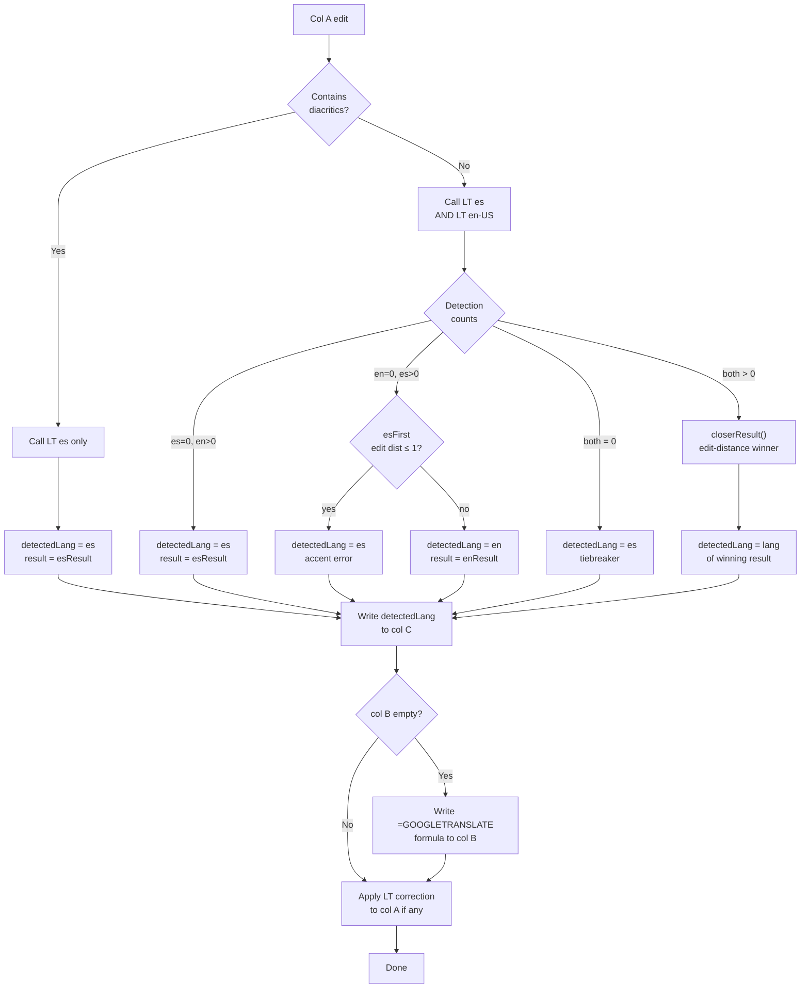

# Bilingual Entry Language Detection

## Summary

Replace `=DETECTLANGUAGE()` in col C with GAS-driven language detection, and add a `GOOGLETRANSLATE` formula to col B so the user can type in either English or Spanish and have both columns filled automatically.

The detection mechanism is LanguageTool's zero-TYPO-match oracle: call LT `es` and LT `en-US` on every col A edit; the endpoint that returns zero `misspelling`/`typographical` matches is the word's language. GAS writes "es" or "en" to col C via `setValue()`; the GOOGLETRANSLATE formula in col B reads col C for direction.

## Problem Frame

`=DETECTLANGUAGE(A)` is a generic 100-language classifier. For short words it returns wrong codes — "pero" as Croatian, "hace" as Romanian, "como" as various — because short words appear identically across many Romance languages. The misclassification routes `enrich_dreaming_urls.py` to the wrong column and requires the user to manually enter both Spanish and English on every row. The user types vocabulary in both languages; the sheet must detect which without user intervention. (See origin doc for full problem frame.)

## Requirements

**Detection**

- R1. When col A is edited, GAS must determine whether the entry is Spanish or English and write "es" or "en" to col C.
- R2. Detection must be accurate for correctly spelled words in both languages.
- R3. Words containing Spanish diacritics (ñ, á, é, í, ó, ú, ü, uppercase equivalents, ¿, ¡) must be classified "es" without DETECTLANGUAGE.
- R4. When LT accepts a word in one language (zero TYPO/typographical matches) and flags it in the other, that language wins.
- R5. Words LT accepts in both languages must default to "es".
- R6. When col A is empty, col C must not be set to "es" or "en".

**Translation**

- R7. Col B must contain a formula that auto-populates the translation of col A into the opposite language, using col C for direction.
- R8. When col C is "es", col B translates Spanish → English. When col C is "en", col B translates English → Spanish.
- R9. When col A is empty, col B must be empty.

**Integration**

- R10. `enrich_dreaming_urls.py` routing must continue unchanged: col C "es" queries col A; any other value queries col B.
- R11. `sheets_to_anki.py` must continue unchanged, reading col A (front) and col B (back).
- R12. GAS must still correct Spanish accents and spelling in col A in addition to writing col C.

## Key Technical Decisions

**Drop `language='auto'`; always call both LT `es` and LT `en-US`.**
`language=auto` is the root cause: it returns Italian for "pero" and Romanian for "hace" (prior learning — `docs/solutions/logic-errors/spanish-accent-guard-english-bailout-regression.md`). Both endpoints are needed for the zero-match oracle. Removing `auto` collapses three call paths (auto → English branch → fallback) into one, simplifying the code significantly. Cost: every non-diacritic col A edit makes 2 LT calls instead of sometimes 1; acceptable at personal vocabulary volumes.

**Spanish diacritics fast-path fires before LT calls and calls only LT `es`.**
A word with ñ, á, etc. is unambiguously Spanish. The fast-path skips the `en-US` call entirely and calls only LT `es` for correction. This saves one API call per diacritic-containing word, which is the common case for Spanish vocabulary.

**Zero-TYPO-match oracle with edit-distance discriminator for the `en=0, es>0` case.**
es=0 and en>0 → "es". Both=0 → "es" (R5 tiebreaker). Both>0 → `closerResult()` edit-distance winner.

The `en=0 and es>0` case requires a discriminator: LT en-US returns 0 matches for both (a) valid English words and (b) Spanish words with accent errors, because LT en-US simply has no rule for these inputs. The two cases are separated by edit distance: Spanish accent fixes are always edit distance ≤ 1 (one character changed), while LT es's "correction" of a genuine English word is much farther. If `firstCorrectedText(text, esResult)` returns a candidate at edit distance ≤ 1 → "es" (accent error); otherwise → "en".

**Detection and correction use different match filters — intentionally.**
Detection (`isDetectionIssue` in `detectLanguage`): counts any misspelling/typographical match regardless of replacement length. This ensures foreign-word flags with shorter replacements (e.g. LT es suggesting "hoy" for "however") are counted for language detection even though they'd be rejected for correction.

Correction (`isSpellingIssue` in `spellingMatches` and `firstCorrectedText`): adds the replacement-length guard (`m.replacements[0].value.length >= m.length`). This prevents shortening corrections like "lucido" → "lucid". The `firstCorrectedText` function used in `closerResult()` and the `en=0,es>0` edit-distance check must also use this narrower filter so the comparison reflects corrections that would actually be applied.

Note: an earlier design required identical filters across all three. This was revised during implementation after discovering that the shared length guard excluded valid "wrong language" signals in the detection step, causing Spanish accent-error words to be classified as English.

**GAS writes the GOOGLETRANSLATE formula to col B when col B is empty.**
`handleEdit` writes the formula after writing col C. Non-empty col B values (user-typed) are not overwritten. A separate `setupTranslationFormulas()` handles existing rows. GAS `setFormula()` does not require the `"` → `""` escaping that the Sheets HTTP API needs — that escaping applies only to `valueInputOption="USER_ENTERED"` in Python callers.

**Col C write via `sheet.getRange(row, 3).setValue(lang)`.**
`setValue()` overwrites the existing `=DETECTLANGUAGE()` formula with plain text. GAS `setValue()` from within a trigger handler does not re-fire `onEdit` — this is a GAS platform guarantee.

## High-Level Technical Design

New `handleEdit` detection flow:



**Col B formula shape (for row `n`):**

```
=IF(An="","",IFERROR(GOOGLETRANSLATE(An,Cn,IF(Cn="es","en","es")),""))
```

- Outer `IF(An="","","")` satisfies R9
- `IFERROR(...)` suppresses `#N/A` for very short or unsupported strings
- `IF(Cn="es","en","es")` routes correctly for both "en" and any unexpected col C value (defaults to Spanish as target)

In GAS, build this as a string with row number concatenated: `'=IF(A' + row + '="","",IFERROR(GOOGLETRANSLATE(A' + row + ',C' + row + ',IF(C' + row + '="es","en","es")),"))'`.

## Implementation Units

### U1. Language detection overhaul — `tools/vocab_spell_check.gs`

**Goal:** `handleEdit` determines language from the LT zero-match oracle and writes "es" or "en" to col C on every col A edit.

**Requirements:** R1, R2, R3, R4, R5, R6, R12.

**Dependencies:** None.

**Files:** `tools/vocab_spell_check.gs`

**Approach:**

1. **Remove the auto-detect path.** Delete lines 57–109 in their entirety: the `callLanguageTool(originalText, 'auto')` call, the `detectedCode`/`confidence`/`isExpected` variables, and both conditional branches. These are fully replaced by the steps below.

2. **Add Spanish diacritics fast-path** immediately after the `originalText` guard (after line 55):
   - Test `/[ñáéíóúüÁÉÍÓÚÜ¿¡]/.test(originalText)`
   - If true: call `callLanguageTool(originalText, 'es')` only; set `detectedLang = 'es'` and `result = esResult`; jump to step 5
   - If the LT call returns null, return early without writing col C

3. **For words without diacritics:** call both `callLanguageTool(originalText, 'es')` and `callLanguageTool(originalText, 'en-US')`. Handle null responses: if both fail, return early; if one fails, treat it as "all matches" (i.e., the other language wins by default).

4. **Add `detectLanguage(text, esResult, enResult)` function.** Uses the same match filter as `firstCorrectedText` (see filter parity note in KTDs):
   - Count filtered matches in each result
   - If `esCount === 0` and `enCount > 0`: return `{lang: 'es', result: esResult}`
   - If `enCount === 0` and `esCount > 0`: return `{lang: 'en', result: enResult}`
   - If both are 0: return `{lang: 'es', result: esResult}` (tiebreaker, R5)
   - If both > 0: `chosen = closerResult(text, esResult, enResult)`; lang = (`chosen === esResult`) ? `'es'` : `'en'`; return `{lang, result: chosen}`

5. **Write detected language to col C:** `cell.getSheet().getRange(cell.getRow(), 3).setValue(detectedLang)`. Skip this write if col A is empty (existing guard at line 55 already returns early, satisfying R6).

6. **Set `result`** to `detection.result` for the correction step. The correction logic at lines 116–153 is **unchanged** — it reads `result.matches` and applies corrections in-place (R12).

**Test scenarios (manual, in the Vocab Sheet):**

| Input (col A) | Expected col C | Expected col A after | Note |
|---|---|---|---|
| `pero` | `es` | `pero` | LT en flags it; LT es returns 0 matches |
| `however` | `en` | `however` | LT es flags it; LT en returns 0 matches |
| `caída` | `es` | `caída` | Diacritics fast-path; no correction needed |
| `caida` | `es` | `caída` | Both flag it; es correction closer (d=1) |
| `ultimamente` | `es` | `últimamente` | Both flag it; es correction closer (d=1) |
| `imbalance` | `en` | `imbalance` | LT en: 0 matches; LT es: TYPO match |
| `casa` | `es` | `casa` | LT es: 0 matches; LT en: TYPO match |
| `no` | `es` | `no` | Both: 0 matches → tiebreaker |
| (clear A) | (unchanged) | (empty) | Early return; R6 satisfied |

---

### U2. Auto-translation formula for col B — `tools/vocab_spell_check.gs`

**Goal:** Col B auto-populates with the GOOGLETRANSLATE formula for new entries; `setupTranslationFormulas()` handles existing rows.

**Requirements:** R7, R8, R9.

**Dependencies:** U1 (col C must be written before col B formula evaluates it).

**Files:** `tools/vocab_spell_check.gs`

**Approach:**

1. **In `handleEdit`, after the correction step**, check if col B is empty at the current row:
   - `sheet.getRange(cell.getRow(), 2).getValue() === ''`
   - If empty, write the GOOGLETRANSLATE formula using `setFormula()` (not `setValue()`)
   - If non-empty, leave col B unchanged (preserves user-typed translations)

2. **Add `setupTranslationFormulas()` function:**
   - Gets the active sheet via `SpreadsheetApp.getActiveSpreadsheet().getActiveSheet()`
   - Reads data range from row 2 to the last row with content in col A
   - For each row where col A is non-empty and col B is empty: writes the GOOGLETRANSLATE formula
   - User runs this once from Extensions → Apps Script → Run to backfill existing rows

**Test scenarios:**

| Setup | Action | Expected col B |
|---|---|---|
| col B empty | Type `pero` in col A | `=IF(A2="","",IFERROR(...))` → evaluates to `"but"` |
| col B has `"but"` | Type `pero` in col A | Unchanged (`"but"` preserved) |
| col B empty | Type `however` in col A | Formula evaluates to `"sin embargo"` |
| col A empty, col B has formula | (formula auto-evaluates) | `""` (R9 satisfied by `IF(An="","",...)`) |
| Run `setupTranslationFormulas()` | — | All empty col B cells with non-empty col A receive formula |

---

### U3. Update workflow documentation — `docs/vocab-workflow.md`

**Goal:** The workflow doc reflects the new column ownership and detection flow.

**Requirements:** None (documentation unit).

**Dependencies:** U1, U2 shipped.

**Files:** `docs/vocab-workflow.md`

**Approach:**

1. Update the **column map table** "Written by" column:
   - Col B: "User" → "GOOGLETRANSLATE formula (GAS-written on first edit)"
   - Col C: "User / spell-check inference" → "GAS (`vocab_spell_check.gs`)"

2. Update the **Mermaid flowchart** SPELLCHECK subgraph:
   - Remove `LT_AUTO` node and its edges
   - Add diacritics check → `LT_ES` fast-path node
   - Add dual-call path (`LT_ES` + `LT_EN`) → detection → col C write
   - Add col B formula write node

## Acceptance Examples

Carried forward from origin doc (all AE-IDs are stable):

- AE1. `"pero"` → col C = `"es"`, col B = `"but"`. LT en-US flags as unknown; LT es returns 0 matches.
- AE2. `"however"` → col C = `"en"`, col B = `"sin embargo"`. LT es flags; LT en-US returns 0 matches.
- AE3. `"caida"` → col A corrected to `"caída"`; col C = `"es"`; col B = `"fall"`. Both LT endpoints flag; es correction is edit distance 1.
- AE4. `"ultimamente"` → col A corrected to `"últimamente"`; col C = `"es"`; col B = `"lately"`. Same mechanism as AE3.
- AE5. `"casa"` → col C = `"es"`, col B = `"house"`. GAS detection overrides any DETECTLANGUAGE mismatch.
- AE6. `"no"` → col C = `"es"` (tiebreaker, R5); col B = `"no"`.
- AE7. Empty col A → col C and col B unchanged.

## Scope Boundaries

- Third-language input (French, Italian, etc.) resolves to "es" or "en" via the tiebreaker; no distinct third-language handling.
- Manual col C overrides: GAS overwrites col C on every col A edit; user-typed "es"/"en" in col C does not persist.
- Backfilling col B for existing rows is handled by `setupTranslationFormulas()`, not automatically on deploy.
- `enrich_dreaming_urls.py` and `sheets_to_anki.py` require no changes (R10, R11).

## Risks & Dependencies

**LanguageTool free API rate limit.** The free LT API allows roughly 20 requests/minute. Every non-diacritic col A edit now makes 2 calls; diacritic words make 1. The bulk-paste guard (lines 48–52) already restricts bulk edits to the first row, which limits burst exposure. At personal vocabulary volumes this limit is not at risk.

**GOOGLETRANSLATE formula quota.** Google limits GOOGLETRANSLATE formula evaluations (~1000/day for consumer accounts). New word entries trigger one evaluation per edit. At personal vocabulary volumes this limit is not at risk.

**`detectLanguage` filter parity.** The match filter predicate in `detectLanguage` must be kept identical to `firstCorrectedText` and `spellingMatches`. Divergence causes the zero-match oracle to count candidates that the correction step would reject — a "ghost" comparison that produces wrong language attribution. See prior learning for the full regression anatomy.

## Operational Notes

After U1 and U2 are complete:

1. **Deploy GAS.** Copy the updated `tools/vocab_spell_check.gs` into the Vocab Sheet's Apps Script editor (Extensions → Apps Script), replacing the existing code. The existing `createTrigger()` registration does not need to be re-run.

2. **Run `setupTranslationFormulas()` once.** In the Apps Script editor, select `setupTranslationFormulas` from the function dropdown and click Run. This writes the GOOGLETRANSLATE formula to all existing rows where col A is non-empty and col B is empty.

3. **Remove the DETECTLANGUAGE formula from col C (optional).** If the sheet's data rows still have `=IF(A2="","",DETECTLANGUAGE(A2))` in col C, GAS will overwrite them on the next col A edit. Rows that are never re-edited will continue showing the DETECTLANGUAGE result in col C until touched. This is acceptable per scope boundary (backfilling deferred).

## Sources

- `tools/vocab_spell_check.gs` — primary target; `handleEdit` (line 39), `callLanguageTool` (line 215), `closerResult` (line 161), `firstCorrectedText` (line 174), `editDistance` (line 190)
- `tools/enrich_dreaming_urls.py` — col C routing at lines 252–257; no changes required
- `docs/solutions/logic-errors/spanish-accent-guard-english-bailout-regression.md` — prior learnings on LT dual-call pattern, `issueType` filter parity, `language=auto` unreliability for short words
- `docs/brainstorms/2026-06-21-bilingual-entry-language-detection-requirements.md` — origin; all R-IDs and AE-IDs carried forward
