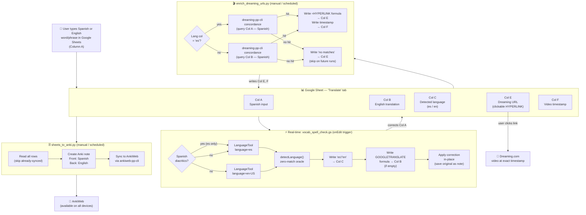

# Vocabulary Workflow

## Column map

| Col | Content | Written by |
|-----|---------|-----------|
| A | Spanish or English word / phrase (input side) | User |
| B | Translation into the other language | GOOGLETRANSLATE formula (GAS-written on first edit) |
| C | Detected language (`es` / `en`) | `vocab_spell_check.gs` |
| E | Dreaming.com video URL (clickable HYPERLINK formula) | `enrich_dreaming_urls.py` |
| F | Video timestamp for the first concordance hit | `enrich_dreaming_urls.py` |

## Language routing in enrichment

- **Col C = `es`** → the Spanish word is in Col A → query Col A  
- **Col C = `en`** → the Spanish translation is in Col B → query Col B  
- **Col C blank** → falls back to Col B

## Tools

| Tool | Trigger | What it does |
|------|---------|-------------|
| `vocab_spell_check.gs` | Every Col A edit (Apps Script onEdit) | Detects language (writes Col C), writes GOOGLETRANSLATE formula to Col B, corrects spelling/accents, saves original as cell note |
| `enrich_dreaming_urls.py` | Manual or scheduled | Queries dreaming-pp-cli concordance, writes HYPERLINK + timestamp, batches all writes in one API call |
| `sheets_to_anki.py` | Manual or scheduled | Reads sheet, creates Anki notes, syncs to AnkiWeb via ankiweb-pp-cli |
